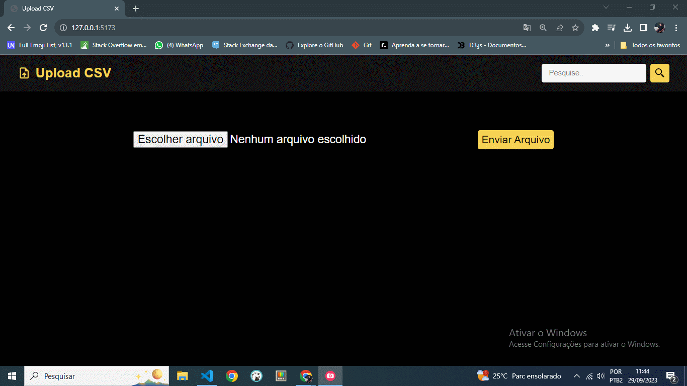

# 🏆 Desafio CSV - FullStack

#  1 - Trilha Back-end

Esta é uma aplicação desenvolvida em NodeJS e TypeScript com um banco de dados SQLite que deve receber um arquivo .CSV e salvá-lo, com uma opção de busca por qualquer parâmetro que possa existir.

## Funcionalidades

- Validar e salvar um arquivo CSV.
- Buscar dados usando qualquer parâmetro de filtro/pesquisa.

## Como executar a aplicação

1. Certifique-se de que você tem o Node.js instalado em seu ambiente.
2. Clone este repositório.
3. Instale as dependências usando `npm install`.
4. Inicie a aplicação com `npm run dev`.
5. Para salvar seu arquivo CSV, acesse a aplicação através da rota http://localhost:3000/api/files usando o método POST e passe seu arquivo, conforme mostrado no vídeo acima, usando a ferramenta INSOMNIA.
6. Se quiser visualizar o banco de dados gerado com seu arquivo salvo, execute `npx prisma studio`.
7. Para fazer uma busca, acesse a aplicação através da rota http://localhost:3000/api/users/ usando o método Get e passe seu parâmetro de busca, por exemplo, '?q=JHON'.
8. Execute os testes da aplicação com `npm run test`.

## 🛠 Ferramentas

- [NODE](https://nodejs.org/)
- [TYPESCRIPT](https://www.typescriptlang.org/docs)
- [PRISMA](https://www.prisma.io/docs)
- [SQLITE](https://www.sqlite.org/docs.html)
- [JEST](https://jestjs.io/pt-BR/)
- [INSOMNIA](https://insomnia.rest/download)
- [VISUAL-STUDIO-CODE](https://code.visualstudio.com/)

##  
# 2 - Trilha FrontEnd

Esta é uma aplicação desenvolvida em NodeJS e React com Vite. Conexão com API gerada na trilha de BanckEnd. Acesso e manipulação das Rotas com a Funcionalidade de Upload, Pesquisa e Visualização Detalhada dos dados Salvos

## Funcionalidades

- Validar e salvar um arquivo CSV.
- Buscar dados usando qualquer parâmetro de filtro/pesquisa.
- Exibir detalhes.

## Como executar a aplicação

1. Certifique-se de que você tem o Node.js instalado em seu ambiente.
2. Clone este repositório.
2. Acesse a Pasta APP do projeto.
3. Instale as dependências usando `npm install`.
4. Inicie a aplicação com `npm run dev`.
5. A Aplicação sera iniciada com Vite e disponível na porta `http://127.0.0.1:5173/`
6. Se quiser visualizar o banco de dados gerado com seu arquivo salvo, execute `npx prisma studio`.
7. Lembre-se de iniciar a aplicação da trilha Back-end citada a cima.

## 🛠 Ferramentas

- [REACT](https://react.dev/)
- [VITE](https://vitejs.dev/)
- [JavaScript](https://developer.mozilla.org/pt-BR/docs/Web/JavaScript)
- [CSS](https://developer.mozilla.org/pt-BR/docs/Web/CSS)

## Contribuição

Se você tiver alguma sugestão, envie para devandersonmotta@gmail.com com o assunto: "contribution challengeCSV" ou entre em contato comigo pelo LinkedIn.

## Licença

MIT

## ✉ Contato

email: devandersonmotta@gmail.com

linkedin: www.linkedin.com/in/anderson-motta-96b138235
---

## 💡 Objetivo

Praticar os conceitos FullStack, Front-End e Back-end integrados em um único projeto.

## Observação
O arquivo .env já foi criado para facilitar o uso da aplicação.