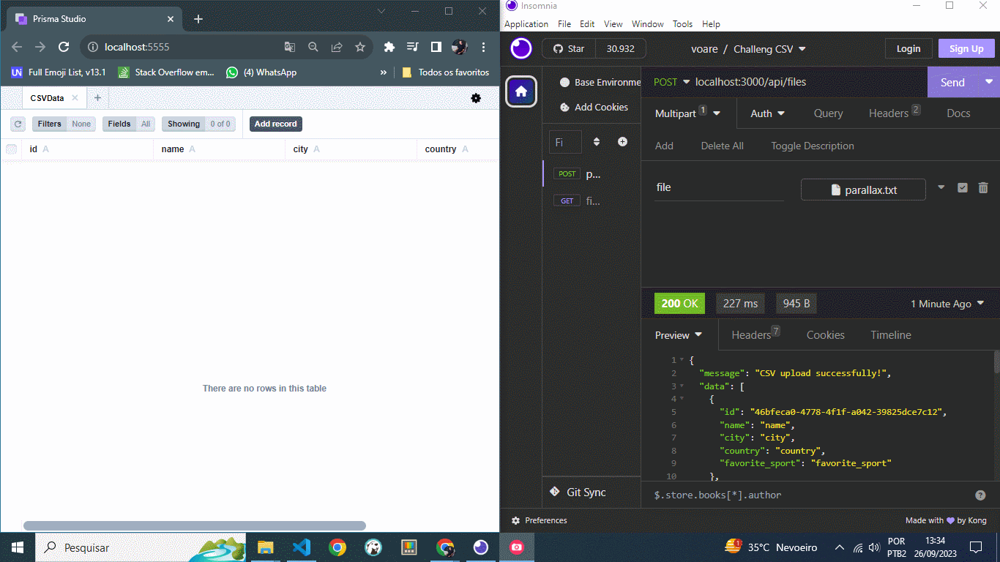

# 🏆 Challenge CSV

This is an application developed in NodeJS and Typescript with an SQlite database that should receive a .CSV file and save it, with an option to search by any parameter that may exist.

## Features

- Validate and Save a CSV File.
- Search for data using any filtering/search parameter.

## How to Run the Application

1. Make sure you have Node.js installed in your environment.
2. Clone this repository.
3. Install the dependencies using `npm install`.
4. Start the application with `npm run dev`.
5. To Save your CSV File, access the application through the route http://localhost:3000/api/files using the POST method and pass your File, as shown in the video above, using the INSOMNIA Tool.
6. If you want to View the Database generated with your Saved File, run `npx prisma studio`.
7. To Search, access the application through the route http://localhost:3000/api/users/ using the Get method and pass your search parameter, for example, '?q=JHON'.
8. Run the application tests with `npm run test`.

## 🛠 Tools

- [NODE](https://nodejs.org/)
- [TYPESCRIPT](https://www.typescriptlang.org/docs)
- [PRISMA](https://www.prisma.io/docs)
- [SQLITE](https://www.sqlite.org/docs.html)
- [JEST](https://jestjs.io/pt-BR/)
- [INSOMNIA](https://insomnia.rest/download)
- [VISUAL-STUDIO-CODE](https://code.visualstudio.com/)

## Contribution

If you have any suggestions, send them to devandersonmotta@gmail.com with the subject: "contribution challengeCSV" or contact me on LinkedIn.

## License

MIT

## ✉ Contact

email: devandersonmotta@gmail.com

linkedin: www.linkedin.com/in/anderson-motta-96b138235
---

## 💡 Objective

Practice the concepts of NodeJS, TypeScript, Prisma ORM, SQLite Database, and test coverage with JEST.

## Observation  
The .env file has already been created to facilitate the use of the application.
